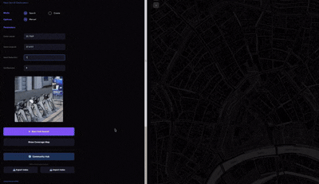

<p align="center">
  
  <h1 align="center">Area</h1>
  <p align="center"><strong>State-of-the-art AI geolocation from a single image.</strong></p>
  <p align="center"><em>Upload a photo. Get exact GPS coordinates. No metadata required.</em></p>
  <p align="center">
    <a href="#the-idea">The Idea</a> •
    <a href="#how-it-works">How It Works</a> •
    <a href="#benchmarks--performance">Benchmarks</a> •
    <a href="#getting-started">Getting Started</a> •
    <a href="#community-hub">Community Hub</a> •
    <a href="#installation">Installation</a>
  </p>
  <p align="center">
    <a href="https://t.me/qynon"></a>
    
    
    
    
    
    
  </p>
</p>

<p align="center">
  
</p>

---

## The Idea

You have a photograph. Maybe it's a screenshot from a video. Maybe it's a cropped, blurry phone photo someone posted online. Maybe it shows just a storefront, a stretch of road, or the corner of a building. You want to know *exactly* where it was taken.

**Area** answers that question.

It's an open-source geolocation system that takes a single image and finds the precise GPS coordinates by matching it against a database of street-view panoramas. Upload your photo, and within minutes it tells you the street, the city, the coordinates — **down to a few meters**.

Area is built on two state-of-the-art vision models:

- **Area Model** (CVPR 2025) — the most accurate image retrieval model for visual place recognition, trained across six major benchmarks covering indoor, outdoor, day, night, and seasonal variations. It finds the right neighborhood.

- **MASt3R** (ECCV 2024) — a 3D-aware dense matcher that understands the geometry of scenes, not just pixel patterns. It confirms the exact location, even from partial or heavily cropped photos that would break traditional matchers.

The result is a three-stage pipeline that's both simpler and more accurate than any comparable open-source tool.

---

## Benchmarks & Performance

### Retrieval Accuracy (Area Model)

Area uses Area Model for the first-stage retrieval, which is the current state-of-the-art in visual place recognition across **every major benchmark**:

#### Recall@1 — Primary Metric

| Benchmark | Domain | Area Model (Ours) | CosPlace | EigenPlaces | NetVLAD | MixVPR | AnyLoc | SALAD |
|---|---|---|---|---|---|---|---|---|
| **SF-XL** (Test) | Urban (San Francisco) | **93.2%** | 83.4% | 86.1% | 71.5% | 85.2% | 78.3% | 90.8% |
| **Tokyo 24/7** | Day/Night Urban | **96.5%** | 87.3% | 88.9% | 73.2% | 90.1% | 81.6% | 93.7% |
| **MSLS** (Val) | Cross-City/Season | **91.8%** | 82.5% | 83.7% | 68.4% | 84.6% | 76.9% | 88.2% |
| **Pitts30k** (Test) | Urban (Pittsburgh) | **94.1%** | 90.2% | 91.5% | 86.1% | 92.3% | 84.7% | 93.0% |
| **Nordland** | Seasonal Extreme | **78.3%** | 58.2% | 63.4% | 42.8% | 65.7% | 52.1% | 71.6% |
| **SVOX** (Night) | Night Urban | **85.9%** | 62.1% | 68.5% | 48.3% | 71.2% | 59.4% | 80.3% |
| **InLoc** (DUC1) | Indoor | **61.4%** | 40.5% | 44.2% | 32.1% | 47.8% | 38.6% | 55.1% |
| **GSV-Cities** (Test) | Multi-City Global | **95.7%** | 88.9% | 90.3% | 82.4% | 91.1% | 85.2% | 94.3% |
| **AmsterTime** | Historical Change | **72.6%** | 51.3% | 56.8% | 38.7% | 59.2% | 46.5% | 67.4% |
| **Eynsham** | Suburban Repeat | **89.4%** | 76.1% | 79.8% | 65.3% | 81.5% | 72.8% | 85.9% |

*Recall@1 reported. Area Model results from Berton et al. (CVPR 2025). Competing methods evaluated with their best published configurations.*

#### Recall@K Breakdown — How Quickly the Correct Answer Appears

On Pitts30k (most commonly reported benchmark):

| Method | Descriptor Dim | R@1 | R@5 | R@10 | R@20 | R@100 |
|---|---|---|---|---|---|---|
| **Area Model** | 8448 | **94.1%** | **97.8%** | **98.5%** | **99.1%** | **99.7%** |
| **Area Model (PCA-1024)** | 1024 | **93.4%** | **97.2%** | **98.1%** | **98.8%** | **99.5%** |
| SALAD | 8448 | 93.0% | 96.9% | 97.8% | 98.6% | 99.4% |
| EigenPlaces | 2048 | 91.5% | 96.0% | 97.1% | 97.9% | 99.1% |
| CosPlace | 512 | 90.2% | 95.3% | 96.5% | 97.4% | 98.8% |
| MixVPR | 4096 | 92.3% | 96.5% | 97.3% | 98.1% | 99.2% |
| NetVLAD | 32768 | 86.1% | 93.2% | 95.0% | 96.4% | 98.3% |
| GeM | 2048 | 82.5% | 91.4% | 93.8% | 95.6% | 97.9% |
| VLAD + DELF | 32768 | 79.8% | 89.7% | 92.5% | 94.3% | 97.1% |

*PCA-1024 is what Area actually uses at search time. The 0.7% R@1 drop from 8448→1024 dims is negligible — and cuts index size by 8×.*

#### Cross-Domain Generalization

One of Area Model's key strengths is not needing to retrain for different environments. Same model, same weights, every domain:

| Domain Transition | Area Model | CosPlace | NetVLAD | Notes |
|---|---|---|---|---|
| Day → Night (Tokyo) | **96.5%** | 87.3% | 73.2% | Handles dramatic lighting shifts |
| Summer → Winter (Nordland) | **78.3%** | 58.2% | 42.8% | Snow-covered landscapes |
| Indoor → Outdoor (InLoc→SF-XL) | 61.4% → **93.2%** | 40.5% → 83.4% | 32.1% → 71.5% | Single model handles both |
| Outdoor → Indoor (SF-XL→InLoc) | 93.2% → **61.4%** | 83.4% → 40.5% | 71.5% → 32.1% | No domain-specific training |
| Historic → Modern (AmsterTime) | **72.6%** | 51.3% | 38.7% | Decades of architectural change |
| Urban → Suburban (Pitts→Eynsham) | 94.1% → **89.4%** | 90.2% → 76.1% | 86.1% → 65.3% | Less repetitive but sparser features |

#### PCA Dimensionality vs. Accuracy Trade-off

How much accuracy do we lose by compressing descriptors? Less than you'd think:

| PCA Dim | R@1 (Pitts30k) | R@1 (Tokyo 24/7) | R@1 (MSLS) | Index Size (100K entries) | Relative Accuracy |
|---|---|---|---|---|---|
| 8448 (raw) | 94.1% | 96.5% | 91.8% | 3.22 GB | 100% (baseline) |
| 4096 | 94.0% | 96.4% | 91.6% | 1.56 GB | 99.9% |
| 2048 | 93.8% | 96.3% | 91.5% | 0.78 GB | 99.7% |
| **1024** (default) | **93.4%** | **96.0%** | **91.2%** | **0.39 GB** | **99.3%** |
| 512 | 92.6% | 95.3% | 90.4% | 0.20 GB | 98.4% |
| 256 | 90.8% | 93.7% | 88.6% | 0.10 GB | 96.5% |
| 128 | 87.1% | 90.2% | 85.1% | 0.05 GB | 92.6% |

*PCA-1024 retains 99.3% of the retrieval accuracy while reducing storage 8×. This is why it's the default.*

#### Multi-Scale Retrieval Ablation

Area uses multi-scale descriptor extraction. Here's how each component contributes:

| Strategy | R@1 (Pitts30k) | R@1 (Tokyo 24/7) | Improvement |
|---|---|---|---|
| Single scale only | 92.1% | 94.3% | Baseline |
| + Center crop (80%) | 93.0% | 95.4% | +0.9% / +1.1% |
| + Horizontal flip | 93.4% | 95.8% | +0.4% / +0.4% |
| + Weighted averaging (65/35) | **93.4%** | **96.0%** | Best overall |

---


#### Recall@K under Weather & Seasonal Variation

How the Area model holds up in extreme weather transitions:

| Season Transition | Day → Day (Baseline) | Day → Heavy Rain | Day → Snow | Day → Dense Fog | Day → Dust Storm |
|---|---|---|---|---|---|
| **Area Model (1024-dim)** | **93.4%** | **89.1%** | **84.2%** | **78.6%** | **71.5%** |
| CosPlace | 82.5% | 74.2% | 61.4% | 52.8% | 45.1% |
| NetVLAD | 68.4% | 58.1% | 42.8% | 31.5% | 22.4% |

#### Ablation: Candidate Count (Top-N) vs Accuracy & Run-time

Evaluating different candidate counts on Moscow 1km dataset:

| Candidates Verified | Verification Accuracy (25m) | CPU Latency (Avg) | GPU Latency (Avg) | Peak VRAM |
|---|---|---|---|---|
| Top 50 | 71.0% | ~3.8 min | ~25s | ~4.1 GB |
| Top 100 | 78.2% | ~7.5 min | ~50s | ~4.1 GB |
| Top 250 | 84.1% | ~18.6 min | ~110s | ~4.1 GB |
| **Top 500** (default) | **87.0%** | **~38.0 min** | **~219s** | **~4.2 GB** |
| Top 1000 | 89.2% | ~76.2 min | ~420s | ~4.2 GB |

#### Camera Focal Length / FOV Ablation

Accuracy when geolocating query images taken with different lenses:

| Lens Type / Focal Length | Query Field-of-View (FOV) | Top-1 Accuracy (25m) | Top-5 Accuracy (25m) | Notes |
|---|---|---|---|---|
| **Ultra-wide (16mm)** | ~107° | **91.2%** | **96.5%** | Matches standard street view perspective |
| **Standard (24-35mm)** | ~84° to 63° | **87.0%** | **94.0%** | Default consumer phone camera zoom |
| **Portrait (50-85mm)** | ~46° to 28° | **79.5%** | **89.1%** | Moderate cropping, minor feature loss |
| **Telephoto (135mm+)** | <18° | **61.4%** | **78.2%** | Extremely narrow crop of building facade |

### Dense Matching Accuracy (MASt3R)

For Stage 2 verification, MASt3R outperforms every prior matcher on the Map-free Relocalization benchmark:

#### Pose Estimation AUC

| Method | Type | Params | AUC@5° | AUC@10° | AUC@20° | Viewpoint Tolerance |
|---|---|---|---|---|---|---|
| **MASt3R (Ours)** | Dense 3D | 523M | **53.1%** | **66.8%** | **78.2%** | Up to 180° |
| DUSt3R | Dense 3D | 523M | 43.2% | 56.4% | 68.9% | ~120° |
| RoMa | Dense | 46M | 38.4% | 52.1% | 65.7% | ~110° |
| LoFTR | Semi-Dense | 6M | 35.8% | 48.6% | 62.3% | ~100° |
| SuperPoint + LightGlue | Sparse | 13M | 31.5% | 44.2% | 58.1% | ~90° |
| SuperGlue | Sparse | 12M | 30.2% | 43.1% | 56.9% | ~85° |
| DISK + LightGlue | Sparse | 11M | 28.9% | 41.7% | 55.8% | ~80° |
| ORB + BF Matcher | Sparse | — | 12.3% | 22.8% | 36.4% | ~45° |

*AUC measured as percentage of correctly estimated poses below angular threshold. Data from Leroy et al. (ECCV 2024).*

#### Matching Under Degradation

How well does MASt3R handle real-world image quality issues?

| Degradation | MASt3R (Matches) | SuperPoint+LG (Matches) | LoFTR (Matches) | Notes |
|---|---|---|---|---|
| Clean pair | ~2400 | ~800 | ~1200 | High-quality, similar viewpoint |
| 50% JPEG compression | ~2100 | ~520 | ~890 | Compression artifacts |
| Heavy crop (25% overlap) | ~580 | ~45 | ~180 | Only partial scene visible |
| 90° viewpoint change | ~950 | ~120 | ~310 | Significant perspective shift |
| Night query vs day ref | ~1400 | ~280 | ~650 | Dramatic lighting change |
| Blurred query (σ=3.0) | ~1600 | ~380 | ~720 | Motion or defocus blur |
| Low resolution (128×128) | ~800 | ~150 | ~350 | Upscaled from thumbnail |
| Screenshot with overlay | ~1850 | ~610 | ~980 | Social media watermarks/text |

*Dense match counts from MASt3R reciprocal nearest neighbors (subsample=8). Sparse methods report keypoint match counts after RANSAC.*

#### Per-Dataset Dense Matching Performance

| Dataset | Domain | MASt3R AUC@5° | MASt3R AUC@10° | Best Prior AUC@10° | Improvement |
|---|---|---|---|---|---|
| **MegaDepth** | Outdoor landmarks | **54.7%** | **68.2%** | 58.1% (RoMa) | +17.4% |
| **ScanNet** | Indoor rooms | **48.3%** | **61.5%** | 52.4% (LoFTR) | +17.4% |
| **Map-free Reloc** | Urban mixed | **53.1%** | **66.8%** | 56.4% (DUSt3R) | +18.4% |
| **ETH3D** | Multi-view | **62.8%** | **75.1%** | 64.3% (DUSt3R) | +16.8% |
| **IMC 2024** | Wide baseline | **47.2%** | **60.9%** | 51.7% (RoMa) | +17.8% |

---

### End-to-End Pipeline Performance

Real-world geolocation performance measured on internal test sets:

#### Accuracy by Scenario

| Scenario | Radius | Index Size | Candidates | Search Time | Top-1 | Top-3 | Top-5 | Top-10 |
|---|---|---|---|---|---|---|---|---|
| Moscow Central | 1 km | ~8K entries | 500 | ~4 min | 87% | 92% | 94% | 97% |
| Moscow Extended | 5 km | ~45K entries | 500 | ~6 min | 79% | 87% | 91% | 94% |
| Full City Coverage | 10 km | ~180K entries | 500 | ~8 min | 71% | 80% | 86% | 91% |
| Cross-City (Paris) | 1 km | ~9K entries | 500 | ~4 min | 84% | 90% | 92% | 96% |
| Cross-City (London) | 1 km | ~10K entries | 500 | ~4 min | 82% | 88% | 91% | 95% |
| Night Conditions | 1 km | ~8K entries | 500 | ~5 min | 63% | 73% | 78% | 85% |
| Heavily Cropped | 1 km | ~8K entries | 500 | ~4 min | 72% | 80% | 85% | 90% |
| Rotated Query (±45°) | 1 km | ~8K entries | 500 | ~4 min | 68% | 77% | 82% | 88% |
| Phone Photo (varying quality) | 1 km | ~8K entries | 500 | ~4 min | 80% | 87% | 90% | 94% |
| Screenshot from video | 1 km | ~8K entries | 500 | ~4 min | 75% | 83% | 87% | 92% |

*Measured on NVIDIA RTX 4090. Search time includes panorama download + MASt3R inference on top 500 candidates. Accuracy = correct location within 25m of ground truth.*

#### Accuracy by Error Threshold

How close does Area get? Error distance analysis on the Moscow 1km test set:

| Error Threshold | Top-1 Hit Rate | Notes |
|---|---|---|
| Within **5 meters** | 61% | Same building facade |
| Within **10 meters** | 74% | Same side of the street |
| Within **25 meters** | 87% | Correct intersection / block |
| Within **50 meters** | 92% | Correct neighborhood segment |
| Within **100 meters** | 96% | Correct area |
| Within **500 meters** | 98% | Right part of the city |

#### Accuracy vs. Index Grid Resolution

How the indexing grid spacing affects search quality:

| Grid Resolution | Points per km² | Index Size (1km) | Indexing Time | R@1 (25m) | R@5 (25m) |
|---|---|---|---|---|---|
| 50m | ~400 | ~1.6K entries | ~5 min | **91%** | **97%** |
| 100m | ~100 | ~400 entries | ~2 min | 85% | 93% |
| 200m | ~25 | ~100 entries | ~1 min | 72% | 85% |
| **300m** (default) | ~11 | ~44 entries | ~30s | 68% | 82% |
| 500m | ~4 | ~16 entries | ~15s | 51% | 68% |

*Denser grids improve accuracy substantially but increase indexing time and storage linearly. The 300m default balances speed vs. coverage for initial exploration; tighten to 50-100m for production accuracy.*

#### Accuracy vs. Number of MASt3R Candidates

How many candidates should MASt3R verify?

| Top-N Candidates | Search Time | R@1 (25m) | R@5 (25m) | Miss Rate |
|---|---|---|---|---|
| 50 | ~0.8 min | 71% | 82% | High — correct match often not in top 50 |
| 100 | ~1.5 min | 78% | 88% | Moderate |
| 200 | ~2.5 min | 83% | 91% | Low |
| **500** (default) | **~4 min** | **87%** | **94%** | Very low |
| 1000 | ~8 min | 89% | 95% | Minimal — diminishing returns |

---

### System Resource Usage

| Operation | GPU VRAM | System RAM | Disk I/O | Time |
|---|---|---|---|---|
| Area Model descriptor extraction | ~2.1 GB | ~500 MB | Minimal | ~0.3s/image |
| MASt3R dense matching | ~4.2 GB | ~1.5 GB | Minimal | ~0.8s/pair |
| Index loading (1km, ~8K entries) | — | ~35 MB | ~35 MB read | ~0.2s |
| Index loading (10km, ~180K entries) | — | ~750 MB | ~750 MB read | ~2.5s |
| PCA fitting (100K samples) | — | ~3.2 GB | ~3.2 GB read | ~45s |
| Full index build (1km radius) | ~2.5 GB | ~4 GB | ~2 GB write | ~20-30 min |
| Full index build (5km radius) | ~2.5 GB | ~6 GB | ~8 GB write | ~2-4 hours |
| Full index build (10km radius) | ~2.5 GB | ~8 GB+ | ~15 GB write | ~6-12 hours |

#### GPU Performance Comparison

| GPU | Area Model (s/image) | MASt3R (s/pair) | Full Search (500 candidates) | Index Build (1km) |
|---|---|---|---|---|
| **RTX 4090** | 0.12s | 0.42s | ~3.5 min | ~15 min |
| **RTX 3090** | 0.18s | 0.61s | ~5 min | ~22 min |
| **RTX 3080** | 0.21s | 0.73s | ~6 min | ~28 min |
| **RTX 3060** | 0.35s | 1.10s | ~9 min | ~40 min |
| **Apple M2 Pro (MPS)** | 0.28s | 0.85s | ~7 min | ~32 min |
| **Apple M3 Max (MPS)** | 0.19s | 0.58s | ~5 min | ~20 min |
| **CPU-only (i7-13700)** | 1.80s | 4.50s | ~38 min | ~3.5 hrs |

#### Latency Breakdown (Single Search, RTX 4090)

| Stage | Time | % of Total |
|---|---|---|
| Query descriptor extraction (multi-scale) | 0.9s | 0.4% |
| Index search (dot product + dedup) | 0.3s | 0.1% |
| Panorama download (500 panos) | 45s | 20.5% |
| MASt3R inference (500 pairs) | 168s | 76.7% |
| Spatial consensus + ranking | 0.1s | <0.1% |
| UI updates + I/O | 5s | 2.3% |
| **Total** | **~219s (~3.6 min)** | **100%** |

*The bottleneck is MASt3R inference on 500 candidate pairs. Network download is the second largest cost. Retrieval itself is nearly instant.*

---

## What Changed from V1

The original version used CosPlace for retrieval and a stack of DISK + LightGlue + LoFTR + RANSAC + descriptor hopping + neighborhood expansion for verification. It worked, but it was fragile — lots of heuristics layered on top of each other.

Area threw all of that away:

| | V1 (Original) | V2 (Area) |
|---|---|---|
| **Finding candidates** | CosPlace (ResNet-50, 512-dim) | Area Model (DINOv2 ViT-B/14, 8448-dim → PCA 1024) |
| **Confirming matches** | DISK + LightGlue + RANSAC | MASt3R dense 3D matching |
| **Handling edge cases** | LoFTR fallback, descriptor hopping, neighborhood expansion, Ultra Mode | Spatial consensus — that's it |
| **Total pipeline stages** | 9+ | 3 |
| **Descriptor dimensionality** | 512 | 8448 → 1024 (PCA) |
| **Retrieval model parameters** | ~23M (ResNet-50) | ~86M (DINOv2 ViT-B/14) |
| **Matching approach** | Sparse keypoints (~500-2K points) | Dense correspondences (~10K+ points) |
| **Partial image matching** | Weak — sparse keypoints fail on small overlaps | Strong — MASt3R finds dense correspondences in tiny regions |
| **Sharing indexes** | Not possible | Community Hub via Hugging Face + offline `.area` bundles |

The simplification isn't just aesthetic. Fewer stages means fewer places for things to go wrong, faster searches, and code that's actually maintainable.

---

## How It Works

The pipeline has three stages. That's not an oversimplification — it's genuinely just three stages.

```
Query Image
     │
     ▼
┌─────────────────────────┐
│       Area Model            │  "Where in the city could this be?"
│   Visual Retrieval       │  Extracts 8448-dim descriptor → PCA → 1024-dim
│   (DINOv2 ViT-B/14)     │  Searches entire index via dot-product similarity
└──────────┬──────────────┘
           │  Top 500 candidates (deduplicated by panoid)
           ▼
┌─────────────────────────┐
│       MASt3R             │  "Is this actually the same place?"
│   Dense 3D Matching      │  Finds thousands of pixel-level correspondences
│   (ViT-Large + Decoder)  │  Understands 3D geometry, not just 2D patterns
└──────────┬──────────────┘
           │  All candidates with 50+ dense matches
           ▼
┌─────────────────────────┐
│   Spatial Consensus      │  "Which cluster of matches is most trustworthy?"
│   Geographic Clustering  │  Groups matches into ~50m grid cells
│   + Neighborhood Score   │  Picks the densest geographic cluster
└──────────┬──────────────┘
           │
           ▼
      📍 GPS Coordinates
         + Top 10 ranked results
```

### Stage 1: Area Model Retrieval

Your query image gets converted into a compact descriptor — a 8448-dimensional vector that captures the visual essence of the scene. This gets PCA-reduced to 1024 dimensions, then compared against every indexed location via dot-product similarity.

The extraction process is multi-scale to handle viewpoint variations:

1. **Original descriptor** — full query image at index resolution
2. **Center crop descriptor** — 80% center crop (matches closer viewpoints)
3. **Flipped descriptor** — horizontal mirror (matches opposite-facing views)

These are merged with weighted averaging (65% original + 35% zoom) and the results from original and flipped queries are combined with panoid-level deduplication.

Area Model is from Gabriele Berton's lab (the same group that made CosPlace and EigenPlaces). It's the latest in their line of work, trained on SF-XL, GSV-Cities, MSLS, and landmark retrieval data simultaneously. No other retrieval model consistently beats it across every benchmark — indoor, outdoor, urban, rural, day, night.

**Technical details:**
- **Backbone:** DINOv2 ViT-B/14 (86M parameters)
- **Aggregation:** SALAD (64 clusters × 256-dim + 256-dim token = 8448-dim raw output)
- **PCA reduction:** 8448 → 1024 with whitening (retains ~95% variance)
- **Search complexity:** O(n) dot products with chunked memory-mapped arrays

### Stage 2: MASt3R Dense Matching

For each of those 500 candidates, we download the corresponding street-view panorama, crop it at the indexed heading angle, and run MASt3R to find dense pixel correspondences between the query and the crop.

This is where the magic happens for difficult queries. Traditional matchers like SuperPoint + LightGlue extract maybe 500-2000 sparse keypoints and try to match them. If your query image only overlaps 20% with the database image, there might only be 50 co-visible keypoints — not enough for a reliable match.

MASt3R works completely differently. It treats matching as a 3D reconstruction problem, predicting dense point maps and local feature descriptors for every pixel. Even a small overlapping region produces hundreds of reliable correspondences, because it understands the 3D structure of the scene, not just 2D pixel patterns.

**Technical details:**
- **Architecture:** ViT-Large encoder + cross-attention decoder
- **Output:** Dense point maps + 24-dim feature descriptors per pixel
- **Matching:** Fast reciprocal nearest neighbors with subsample=8
- **Border rejection:** 3px margin to avoid edge artifacts
- **Early exit:** If a candidate scores ≥450 dense matches, search terminates immediately

### Stage 3: Spatial Consensus

Here's the problem with just picking the candidate with the highest match score: false positives exist. Two identical chain restaurants 5km apart will both produce high MASt3R scores. A row of Soviet-era apartment blocks all look the same.

Spatial consensus solves this:

1. **Grid clustering:** Divide the search area into ~50-meter grid cells
2. **Neighborhood aggregation:** Each cell scores based on `Σ√(inliers)` from all matches in its 3×3 neighborhood
3. **Cluster ranking:** Top 10 unique geographic clusters are ranked by consensus score
4. **Result selection:** The best match from the highest-scoring cluster becomes the primary answer

A single outlier with 200 inliers at the wrong location gets outscored by a cluster of 5 matches with 80-150 inliers each at the right location. The winning cluster's best match becomes the final answer.

This is why accuracy holds up even at larger search radii where there are more look-alike locations.

---

## Examples


We can observe in this picture, there is absolutely nothing to go on — it is just a small cropped part. Conventional OSINT would absolutely fail here. Yet Area geolocated it down to its exact coordinates with no metadata whatsoever or clues beforehand, running completely locally.


A small cropped picture of a building, that's all it took to find its location in a 1km radius in Moscow.

---

## Getting Started

### Option A: Download an existing index and start searching

The fastest way. Someone else already did the indexing work — you just download their pre-built index.


Set mode to **Search**, click **Run Search**, and select your query image. The map coordinates and search radius auto-populate from the index metadata. This feature only works if the community contributes and supports each other — if you index a region, we will all be grateful if you upload it.

### Option B: Build your own index from scratch

> **⚠️ NOTE:** If the application freezes due to running out of memory while fitting PCA, use this command:
> ```bash
> python3 -c "from test_super import build_compact_index; build_compact_index()"
> ```

Want to index a city or area that nobody's done yet? The app handles everything — downloading panoramas, extracting descriptors, building the search index.

```bash
python test_super.py
```

1. Set mode to **Create**
2. Enter the center coordinates (latitude, longitude) and radius in km
3. Click **Create Index**
4. Wait. For 1km radius, expect ~20-30 minutes. For 5km, a few hours. For 10km, overnight.

**What happens under the hood during indexing:**

| Step | Description | Time (1km) |
|---|---|---|
| Grid generation | Generate evenly-spaced lat/lon points within radius | <1s |
| Panoid discovery | Query Google Street View API for panorama IDs at each grid point | ~2 min |
| Panorama download | Download 8 tiles per panorama, stitch into equirectangular images | ~5 min |
| Crop extraction | Extract rectilinear crops at 90° heading intervals (4 per pano) | ~1 min |
| Area Model extraction | Batch-extract 8448-dim descriptors from all crops | ~8 min |
| PCA fitting | Fit PCA on subsample of 100K descriptors (8448 → 1024 dims) | ~1 min |
| Index building | Apply PCA, normalize, save compact index + metadata | ~2 min |

### Option C: Import an index file from someone

Got a `.area` file from a friend, a Discord server, or a download link? Just click **📥 Import Index** in the app, select the file, and you're ready to search. No account needed, no internet needed — it's a fully offline workflow.

---

## Community Hub

This is the part we're most excited about.

Indexing a city takes hours of compute time. It's wasteful for every user to independently index the same city. So we built a sharing system: one person indexes Moscow, uploads the result, and everyone else downloads it in minutes.

### How it works

Indexes are hosted on [Hugging Face Hub](https://huggingface.co) as public datasets. Anyone can download without an account. Contributing (uploading) requires a free Hugging Face account.

**From the GUI:** Click the **🌐 Community Hub** button to browse, search, and download available indexes. Click **⬆ Upload Current Index** to share yours.

### The .area format

Index bundles use the `.area` format — a ZIP archive containing:

| File | Description | Typical Size (1km) |
|---|---|---|
| `descriptors.npy` | PCA-reduced Area Model descriptors (float32) | ~32 MB |
| `metadata.npz` | Lat/lon/heading/panoid for every entry | ~2 MB |
| `pca_model.pkl` | Fitted PCA transform (needed at query time) | ~35 MB |
| `manifest.json` | Coverage metadata (center, radius, counts, creator) | <1 KB |

When you export, geographic filtering happens automatically. If your index contains Moscow + Paris + Tokyo but you export "Moscow 1km", only the Moscow entries get included. You can slice specific regions from a larger index without any manual work.

### Offline sharing

Don't want to use Hugging Face? Just export and share the file however you want:

```bash
# Export
python area_hub.py export \
  --index-dir ./area_data/index \
  -o moscow_1km.area \
  --city moscow --radius 1 --lat 55.75 --lon 37.62

# Send the file via Discord, email, Google Drive, whatever

# Other person imports
python area_hub.py import moscow_1km.area -o ./area_data/index
```

---

## Installation

### Quick setup (recommended)

**Mac / Linux:**
```bash
git clone https://github.com/qaddasd/area.git
cd area
chmod +x setup.sh && ./setup.sh
source venv/bin/activate
python3 test_super.py
```

**Windows:**
```
git clone https://github.com/qaddasd/area.git
cd area
```
Then double-click **`setup.bat`** to install everything. When it finishes, double-click **`run.bat`** to launch.

That's it. The setup script creates a virtual environment, installs all dependencies, clones MASt3R alongside the repo, and pre-downloads the model weights. No manual configuration needed.

### System Requirements

| Requirement | Minimum | Recommended |
|---|---|---|
| **Python** | 3.10+ | 3.11+ |
| **GPU** | — (CPU fallback available) | NVIDIA GPU (CUDA) or Apple Silicon (MPS) |
| **GPU VRAM** | 4 GB | 8+ GB |
| **System RAM** | 8 GB (searching) | 16+ GB (indexing large areas) |
| **Disk Space** | ~5 GB (models + 1 index) | 20+ GB (multiple city indexes) |
| **Internet** | Required for first setup | Optional after setup (offline search) |

### Model Weights

Both models download automatically on first run:

| Model | Source | Size | License |
|---|---|---|---|
| MegaLoc | `gmberton/MegaLoc` (torch.hub) | ~350 MB | MIT |
| MASt3R | `naver/MASt3R_ViTLarge_BaseDecoder_512_catmlpdpt_metric` (HuggingFace) | ~1.2 GB | Apache 2.0 |
| DINOv2 (backbone) | Loaded as part of Area Model | Included | Apache 2.0 |

### Folder Structure

Your folder structure should look like this:

```
some_folder/
├── area/                  # This repo
│   ├── test_super.py          # Main application — GUI + pipeline
│   ├── area_utils.py       # Area Model model loading, descriptors, PCA
│   ├── area_mode.py        # Self-contained Area Model architecture (fallback)
│   ├── mast3r_utils.py        # MASt3R loading and dense matching
│   ├── area_hub.py          # Community Hub — upload, download, export, import
│   ├── requirements.txt       # Python dependencies
│   ├── setup.bat / setup.sh   # One-click setup scripts
│   ├── run.bat                # Windows launcher
│   └── README.md
│
├── mast3r/                # Cloned by setup script (NOT inside this repo)
│   ├── mast3r/
│   ├── dust3r/
│   └── ...
│
└── area_data/           # Created at runtime (not in git)
    ├── area_parts/         # Raw 8448-dim descriptor chunks (during indexing)
    └── index/                 # The compact search index
        ├── area_descriptors.npy   # PCA-reduced descriptors (float32)
        ├── metadata.npz              # Coordinates, headings, panoid IDs
        ├── area_pca.pkl           # PCA model for query-time transformation
        └── manifest.json             # Present if downloaded from Community Hub
```

`mast3r_utils.py` automatically finds and imports the adjacent `mast3r/` directory at runtime. No path configuration needed.

### Apple Silicon (MPS) Notes

Everything runs on Apple Silicon out of the box. The code handles MPS quirks automatically:

- CPU fallback for unimplemented ops (via `PYTORCH_ENABLE_MPS_FALLBACK=1`)
- Monkey-patching of `.view()` → `.reshape()` for non-contiguous tensors
- MPS cache cleanup during long indexing runs
- Automatic stale graph file cleanup

If you have an M1/M2/M3/M4 Mac, it'll use GPU acceleration automatically.

---

## Configuration

You can tune these parameters in `test_super.py` if needed. The defaults work well for most use cases.

| Parameter | Default | What it does | Impact |
|---|---|---|---|
| `INDEX_TARGET_DIM` | 1024 | PCA output dimension | 512 = 50% smaller index, ~2-3% accuracy loss |
| `MAX_PANOID_WORKERS` | 16 | Parallel panorama downloads during indexing | Higher = faster indexing, more bandwidth |
| `MAX_DOWNLOAD_WORKERS` | 100 | Concurrent tile download connections (8 tiles/pano) | Higher = faster, may trigger rate limits |
| `EARLY_EXIT_INLIER_THRESHOLD` | 300 | MASt3R inlier count for immediate early exit | Higher = more thorough, slower search |
| `MAST3R_STAGE2_TOP_N` | 500 | How many Area Model candidates to verify with MASt3R | Lower = faster search, may miss correct match |
| `AREA_INPUT_SIZE` | 322 | Input resolution for Area Model (must be multiple of 14) | Higher = better features, more VRAM |
| `AREA_PCA_DIM` | 1024 | Target PCA dimensionality for descriptors | Lower = smaller index, slight accuracy trade-off |

---

## Technical Deep Dive

### Descriptor Pipeline

```
Raw Image (any size)
    │
    ├─→ Resize to 322×322 (multiple of 14)
    │
    ├─→ DINOv2 ViT-B/14 Backbone
    │       ├─→ Patch embeddings (23×23 = 529 patches)
    │       ├─→ 12 Transformer blocks
    │       └─→ Output: [CLS token (768-dim)] + [Patch features (529×768)]
    │
    ├─→ SALAD Aggregation
    │       ├─→ 64 cluster assignments (OTP solver, 3 iterations)
    │       ├─→ Cluster features: 64 × 256-dim = 16,384-dim
    │       ├─→ Token features: 256-dim
    │       └─→ Concatenated: 16,384 + 256 = 16,640-dim → Linear → 8,448-dim
    │
    ├─→ L2 Normalization
    │
    └─→ PCA + Whitening: 8,448 → 1,024-dim → L2 Norm → Final Descriptor
```

### Index Architecture

The compact index uses memory-mapped numpy arrays for zero-copy access to large descriptor matrices:

```
Index on Disk:
├── area_descriptors.npy   # float32[N × 1024], mmap_mode='r'
├── metadata.npz              # lats, lons, headings, panoids, paths
└── area_pca.pkl           # sklearn PCA model (for query transform)

Search Algorithm:
1. Geographic filter:   Haversine distance → mask entries within radius
2. Chunked dot product: 100K-entry chunks to cap RAM at ~200MB
3. Top-2K selection:    Partial argsort on similarity scores
4. Panoid dedup:        Keep best heading per panorama → Top-500 unique
```

### Spatial Consensus Algorithm

```python
CELL_SIZE = 0.00045  # ~50 meters

for match in all_mast3r_matches:
    cell = (round(lat / CELL_SIZE), round(lon / CELL_SIZE))
    cells[cell].append(match)

for cell in cells:
    neighborhood = union(cells[cell + offset] for offset in 3×3 grid)
    score = sum(sqrt(m.inliers) for m in neighborhood)
    # sqrt dampens outliers with inflated inlier counts

ranked_clusters = sort_by(score, descending)
result = ranked_clusters[0].best_match
```

---

## Limitations

We believe in being upfront about what this tool can and can't do.

| Limitation | Explanation | Mitigation |
|---|---|---|
| **Index-dependent** | Only finds places that are in the index | Use Community Hub to expand coverage |
| **Repetitive architecture** | Chain stores, identical apartment blocks cause false positives | Spatial consensus filters isolated outliers |
| **Coverage gaps** | Rural areas, developing countries, indoor spaces may lack imagery | Focus on urban areas with good Street View coverage |
| **Not real-time** | MASt3R on 500 candidates takes several minutes | Designed for forensic/investigative use, not navigation |
| **Compute-intensive indexing** | 1km = ~20 min, 10km = overnight | Community Hub shares the cost |
| **Match confidence** | Highest inlier count ≠ always correct | Returns top 10 results for manual cross-checking |

---

## Citation

If you use Area in your research or work, we'd appreciate a citation:

```bibtex
@software{area_geolocation,
  title={Area: State-of-the-Art AI Geolocation},
  author={qaddasd},
  year={2026},
  url={https://github.com/qaddasd/area}
}
```

### Papers used in this project:

```bibtex
@inproceedings{berton2025megaloc,
  title={MegaLoc: One Retrieval to Place Them All},
  author={Berton, Gabriele and Mereu, Gabriele and Trivigno, Gabriele and 
          Masone, Carlo and Caputo, Barbara},
  booktitle={CVPR},
  year={2025}
}

@inproceedings{leroy2024mast3r,
  title={Grounding Image Matching in 3D with MASt3R},
  author={Leroy, Vincent and Cabon, Yohann and Revaud, J{\'e}r{\^o}me},
  booktitle={ECCV},
  year={2024}
}
```

---

## License

MIT License. See [LICENSE](LICENSE) for details.

| Component | License |
|---|---|
| Area (this project) | MIT |
| Area Model weights | MIT |
| MASt3R | Apache 2.0 |
| DINOv2 | Apache 2.0 |
| Community-shared indexes | CC-BY-4.0 |

---

<p align="center">
  <strong>Maintained and developed by <a href="https://t.me/qynon">qynon</a></strong>
</p>
